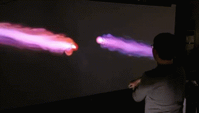

# InteractiveFlowField
An interactive flow field based on Processing and Kinect V2;

The color and density of the emitter can be altered via OSC protocal;

Three libraries are required: KinectPV2, oscP5, PixelFlow;

